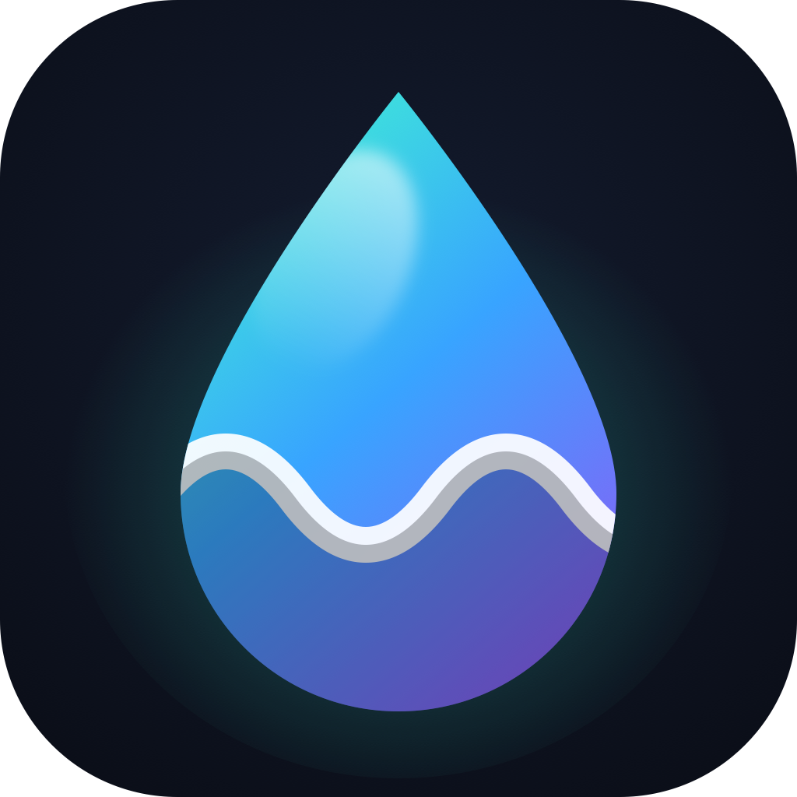

<p align="center">
  
</p>

<h1 align="center">LIQUID</h1>

<p align="center">
  Audio-reactive fluid simulation for live visuals — VJ / projection / TouchDesigner / Resolume.<br/>
  Electron + WebGL2, stable fluids (Jos Stam) + MacCormack advection, full post chain, realtime drum detection, NDI out.
</p>

---

## Features

- 🌊 **GPU fluid solver** — stable fluids, MacCormack dye advection (sharp swirls), vorticity confinement, half-float FBOs
- 🎨 **8 render styles** — watercolor paper (Beer–Lambert pigment), ink, oil paint, contour, neon, smoke, flow-iridescent
- 🎨 **8 gradient palettes** (Joy, Watercolor, Sumi Ink, Teal Ink, Ember, Ultraviolet, Bioluminescent, Vietnam Lacquer) + color spread/cycle
- ✨ **Post chain** — shading + specular, soft-knee bloom, sunrays, ACES grading (lift/gamma/gain), watercolor granulation, IGN dither (projector-safe)
- 🥁 **Realtime drum separation** — 3 độc lập onset detectors (kick 30–120Hz / snare 700–3.5k / hats 6–14k, spectral flux + adaptive threshold), spatially-anchored reactions: kick booms center, snare answers left/right, hats tick along the top
- 🎚 **Mapping matrix** — route sub/bass/mid/treble/kick/snare/hat vào splat force, radius, curl, hue, bloom... với amount + curve
- 🔊 **Audio sources** — input device (soundcard/BlackHole loopback), drag-&-drop audio file (loop), built-in demo beat
- 📺 **NDI out** — named sender "LIQUID", BGRA, backpressure frame dropping; fixed render resolutions (720p → 4K+, custom, letterboxed)
- 💾 **Presets + persistence** — save/load/delete scenes, hotkeys **1–9** với **crossfade**, settings tự khôi phục khi mở app
- 🖥 **Single-window UI** — Tweakpane overlay, `Tab` to hide (không dính vào NDI/capture)

## Run

```bash
npm install
npm run dev
```

> macOS: nếu `@stagetimerio/grandiose` build fail, cài với `--ignore-scripts` rồi copy `dist/grandiose.node` + `dist/libndi.dylib` từ một bản build sẵn (N-API, ABI-stable). Cần NDI runtime.

## Hotkeys (output window)

| Key | Action |
|---|---|
| `Tab` | toggle control panel |
| `F` | fullscreen |
| `Space` | pause |
| `R` / `C` | random splats / clear |
| `1–9` | preset slots (crossfaded) |
| drag | splat trực tiếp |
| drop file nhạc | phát + loop |

## Architecture

```
src/
  main/        — Electron main: state store (persisted), NDI sender (grandiose), presets
  preload/     — contextBridge → window.liquid
  shared/      — params schema, palettes, IPC types, merge utils
  renderer/output/
    main.ts    — render loop, pointer, hotkeys, NDI capture, preset crossfade
    panel.ts   — Tweakpane overlay
    emitters.ts— kick/snare/hat anchored emitters, orbit, edge flow, idle drip
    engine/
      solver/  — FluidSolver + GLSL (advection, vorticity, pressure…)
      post/    — PostChain: bloom, sunrays, display compose (style variants)
      audio/   — AudioEngine: bands, envelopes, 3× onset detection, demo synth
```

## Roadmap

- [x] M1 solver · M2 post chain · M3 audio engine + emitters · M4 presets/crossfade/persistence
- [ ] M5 MIDI learn
- [ ] M6 recording (WebM) + PNG sequence export (10K offline render)
- [ ] M7 packaging (electron-builder), display picker

---

Built with [Claude Code](https://claude.com/claude-code).
